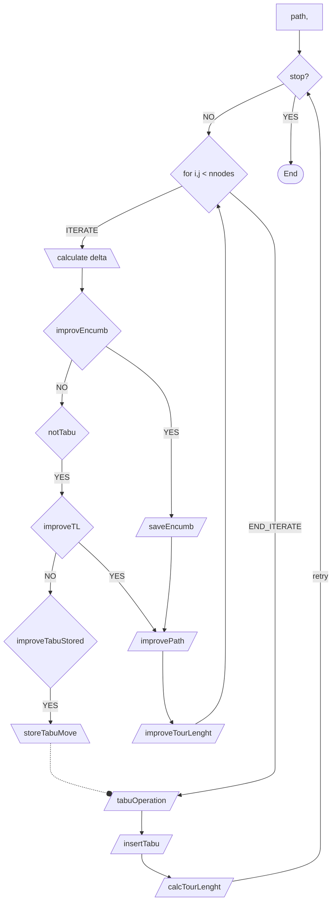

```mermaid
flowchart TD
    A[path, ] -->B{stop?}
    B -->|NO|C{for i,j < nnodes}
    C -->|ITERATE|I0[\calculate delta\]
    I0 --> I1{improvEncumb}
    I1 -->|NO|IT2{notTabu}
    IT2 --> |YES|II{improveTL}
    II -->|YES|I11
    II --> |NO|IT3{improveTabuStored}
    IT3 -->|YES|IT4[\storeTabuMove\]
    IT4 -..-o T0
    I1 -->|YES|I22[/saveEncumb/]
    I22 -->I11[/improvePath/]
    I11 -->I3[/improveTourLenght/]
    I3 -->C
    C -->|END_ITERATE|T0[/tabuOperation/]
    T0 --> T1[/insertTabu/]
    T1 --> T2[/calcTourLenght/]
    T2 -->|retry| B
    B-->|YES|E([End])

```