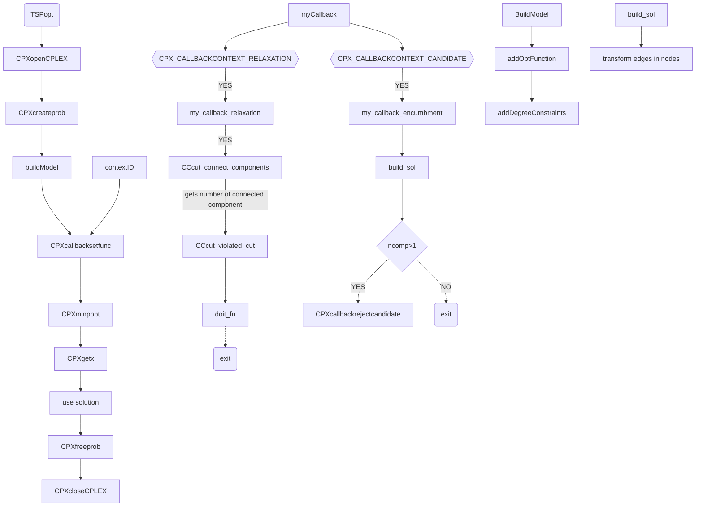

```mermaid
flowchart TD
    M0(TSPopt)-->M01[CPXopenCPLEX]
    M01-->M02[CPXcreateprob]
    M02-->M1[buildModel]
    M1-->M2[CPXcallbacksetfunc]
    P1[contextID]-->M2
    M2-->M3[CPXminpopt]
    M3-->M4[CPXgetx]
    M4-->M5[use solution]
    M5-->M6[CPXfreeprob]
    M6-->M7[CPXcloseCPLEX]


    CB0[myCallback]
    CB0-->I1{{CPX_CALLBACKCONTEXT_RELAXATION}}
    CB0-->I2{{CPX_CALLBACKCONTEXT_CANDIDATE}}
    
    I1-->|YES|L1[my_callback_relaxation]
    I2-->|YES|L2[my_callback_encumbment]


    L1-->|YES|R1[CCcut_connect_components]
    R1-->|gets number of connected component|R2[CCcut_violated_cut]
    R2-->R3[doit_fn]
    R3-.->R3E(exit)

    L2-->L21[build_sol]
    L21-->LI1{ncomp>1}
    LI1-->|YES|LR1[CPXcallbackrejectcandidate]
    LI1-.->|NO|LR2(exit)

    
    


    A1[BuildModel]-->A11[addOptFunction]
    A11-->A12[addDegreeConstraints]

    A2[build_sol]-->A21[transform edges in nodes]


```